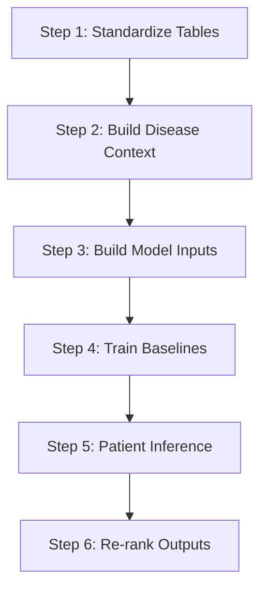

# Pipeline Overview

This repository mirrors the lung planning scaffold and can be specialized for disease-specific branches such as IPF.

## Step 1. Standardize Tables

- Build a `drug master table`
- Build a `cell line master table`
- Normalize response labels and source crosswalks

## Step 2. Build Disease Context

- Construct `LUAD` and `LUSC` signatures
- Build pathway activity views
- Prepare patient-side disease features

## Step 3. Build Model Inputs

- Assemble `sample X`
- Assemble `drug X`
- Assemble `pair X`
- Assemble labels `y`

## Step 4. Train Baselines

- Start with simple baseline models
- Run both `GroupCV` and random split tracks where direct response labels exist
- For IPF, use ranking-friendly pseudo-label baselines

## Step 5. Patient Inference

- Score patient-side profiles with trained models
- For IPF, score disease signatures and fibrosis cell-state programs

## Step 6. Re-rank Outputs

- Combine model score, disease support, and safety/translation filters
